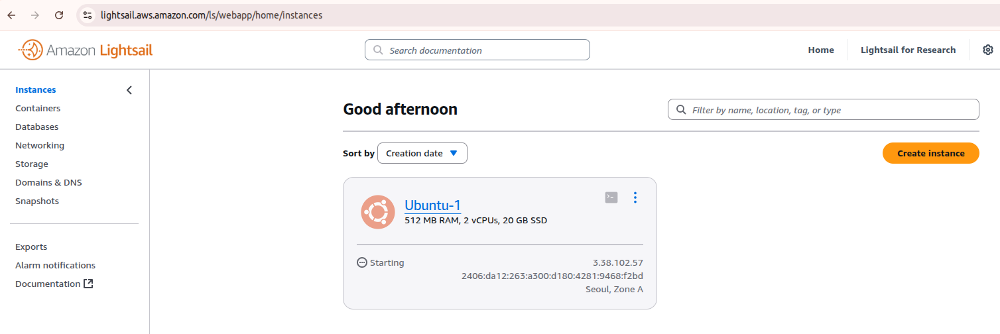
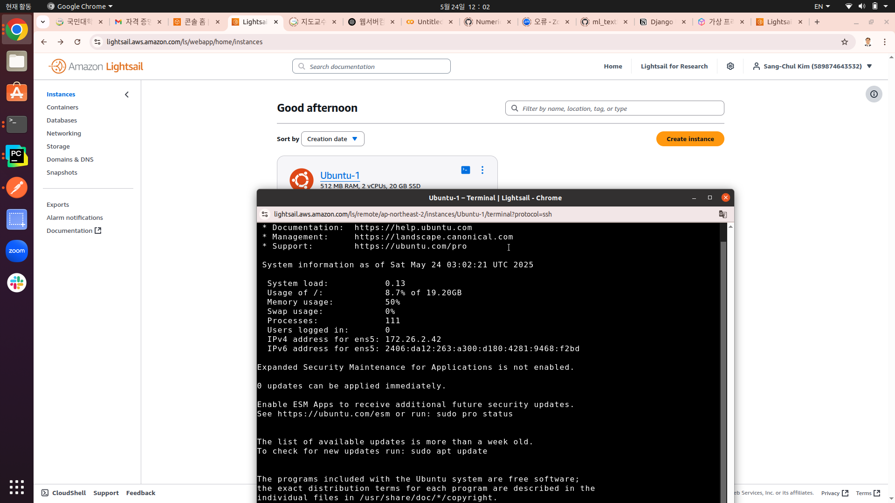
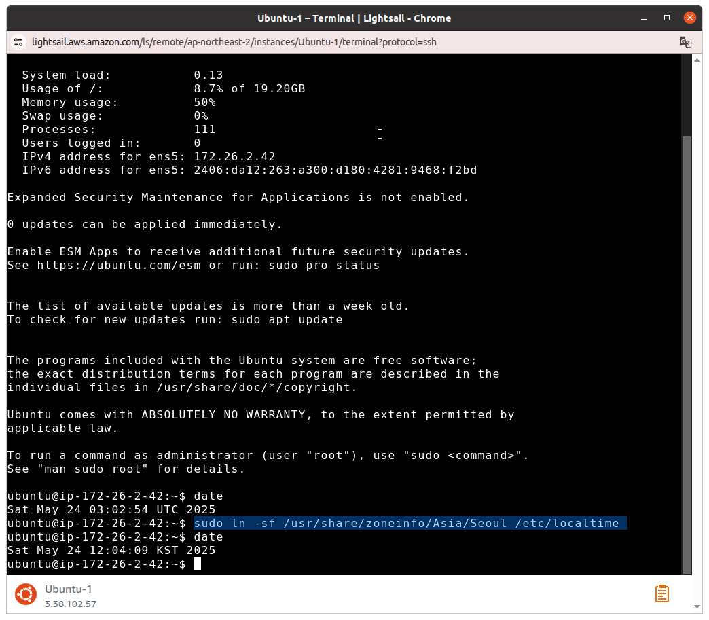
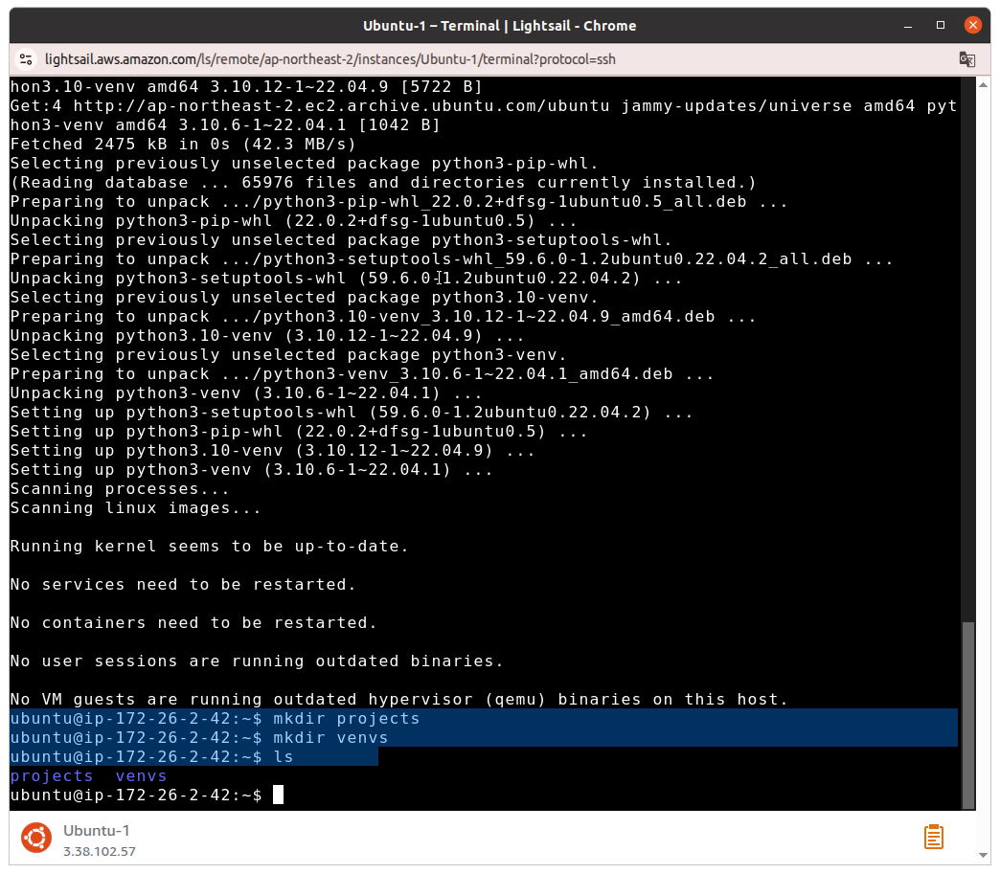
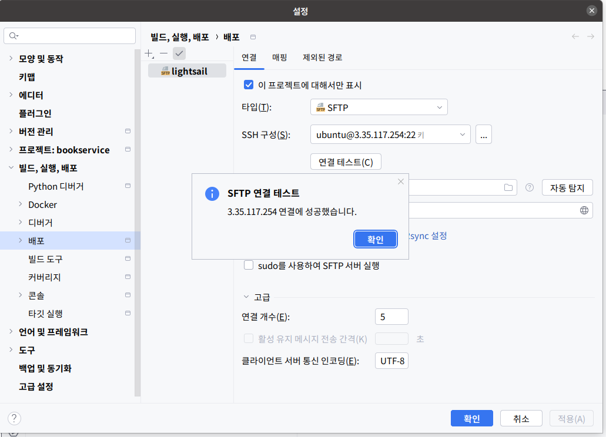
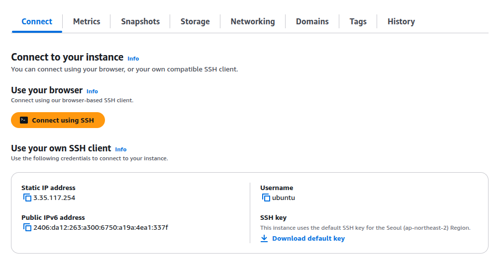
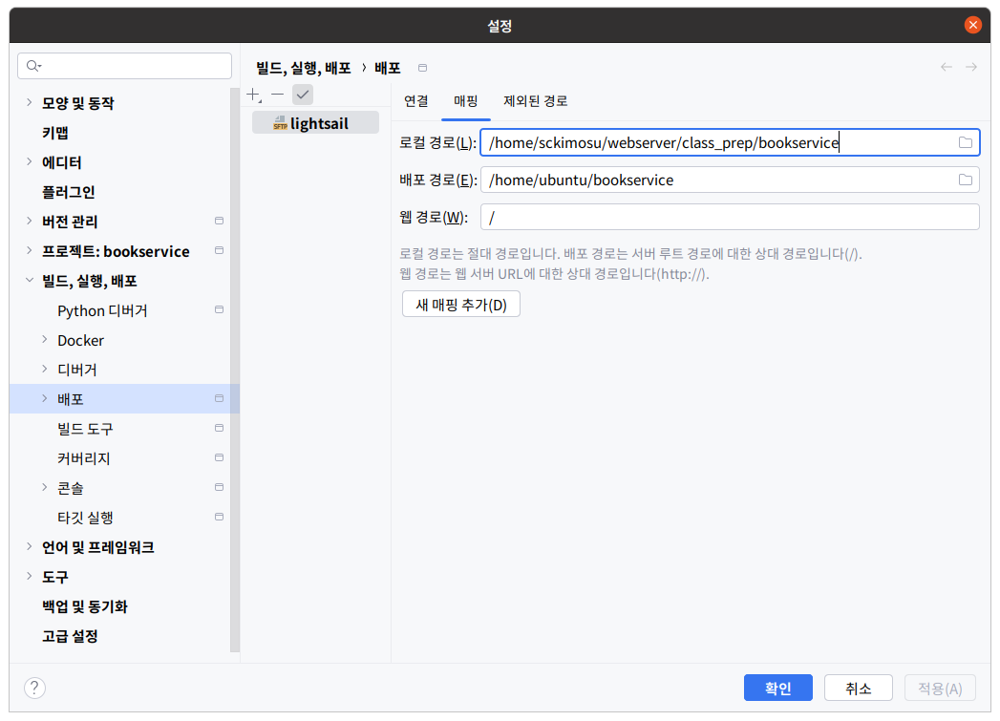

# AWS(Amazon Web Services)

- AWS(Amazon Web Services)는 **Amazon에서 제공하는 클라우드 컴퓨팅 서비스 플랫폼**
- 전 세계 수많은 기업, 스타트업, 정부기관, 학교 등이 사용하는 **가장 대표적인 클라우드 인프라**

---

## ✅ 1. AWS란?

AWS는 인터넷을 통해 서버, 스토리지, 데이터베이스, 네트워크, 머신러닝, 보안 등 IT 리소스를 **필요한 만큼만** 사용할 수 있도록 제공하는 **클라우드 컴퓨팅 플랫폼**.

### 🔹 주요 특징

- **IaaS, PaaS, SaaS 모두 지원**
- **종량제 과금(Pay-As-You-Go)**: 사용한 만큼만 비용 지불
- **높은 가용성과 확장성**: 전 세계 리전/가용영역 제공
- **보안성과 안정성**: 다양한 보안 인증 획득

---

## ✅ 2. AWS 핵심 서비스 분류

### ① 컴퓨팅 (Compute)

| 서비스 | 설명 |
| --- | --- |
| EC2 (Elastic Compute Cloud) | 가상 서버 인스턴스 |
| Lambda | 서버리스 함수 실행 서비스 |
| ECS / EKS | Docker 컨테이너 오케스트레이션 서비스 |
| Lightsail | 간단한 가상 서버 호스팅 (정적 웹 등) |

### ② 저장소 (Storage)

| 서비스 | 설명 |
| --- | --- |
| S3 (Simple Storage Service) | 객체 스토리지 (이미지, 파일 저장용) |
| EBS (Elastic Block Store) | EC2용 블록 스토리지 |
| EFS (Elastic File System) | 공유 가능한 네트워크 파일 시스템 |

### ③ 데이터베이스 (Database)

| 서비스 | 설명 |
| --- | --- |
| RDS | 관계형 DB (MySQL, PostgreSQL 등 관리형) |
| DynamoDB | NoSQL DB |
| Aurora | 고성능 MySQL/PostgreSQL 호환 DB |
| Redshift | 데이터 웨어하우징 (OLAP) |

### ④ 네트워킹 (Networking)

| 서비스 | 설명 |
| --- | --- |
| VPC (Virtual Private Cloud) | 사용자 전용 네트워크 환경 |
| Route 53 | DNS 및 도메인 관리 |
| CloudFront | CDN(Content Delivery Network) |
| API Gateway | REST API 게이트웨이 서비스 |

### ⑤ DevOps 및 배포

| 서비스 | 설명 |
| --- | --- |
| CodeDeploy | 애플리케이션 배포 자동화 |
| CodePipeline | CI/CD 파이프라인 |
| CloudFormation | 인프라를 코드로 관리 (IaC) |
| CloudWatch | 로그 및 모니터링 도구 |

### ⑥ 머신러닝 및 AI

| 서비스 | 설명 |
| --- | --- |
| SageMaker | ML 모델 학습/배포 플랫폼 |
| Rekognition | 이미지/영상 인식 서비스 |
| Lex | 챗봇 구축용 음성/자연어 처리 |
| Polly | 텍스트를 음성으로 변환 (TTS) |

---

## ✅ 3. AWS 인프라 구조

```
Region (리전)
  └─ Availability Zone (AZ, 가용영역)
       └─ Data Center (물리적 서버실)

```

- **리전(Region)**: 물리적으로 분리된 AWS 데이터 센터 위치 (예: 서울, 도쿄, 오하이오 등)
- **가용영역(AZ)**: 하나의 리전 내 여러 독립적인 데이터 센터 (예: ap-northeast-2a, 2b, 2c)

---

## ✅ 4. AWS 사용 흐름 예시 (Django 배포 예)

1. **EC2 인스턴스 생성**
    - Ubuntu 서버 설정, SSH 연결
2. **Django 프로젝트 업로드**
    - Git 또는 zip 파일 업로드
3. **Gunicorn + Nginx 구성**
    - 애플리케이션 서버 + 리버스 프록시 설정
4. **도메인 연결 + HTTPS 인증서 설치 (Route 53 + ACM)**
5. **S3, RDS, CloudFront 등 추가 구성 가능**

---

## ✅ 5. AWS의 장점과 유의점

### ✅ 장점

- 사용한 만큼만 과금 (TCO 절감)
- 고가용성, 자동 스케일링, 글로벌 서비스
- DevOps 친화적, 다양한 오픈소스와 호환
- 광범위한 서비스 통합

### ⚠️ 유의점

- 초보자는 요금 관리에 주의 필요
- 지나치게 많은 서비스 → 학습 필요
- 리전별 서비스 지원 차이 존재

---

## ✅ 6. 자격증 및 학습 경로

| 자격증 | 설명 |
| --- | --- |
| AWS Cloud Practitioner | 입문용 인증서 |
| AWS Solutions Architect – Associate | 시스템 아키텍처 설계자용 |
| AWS Developer | 개발자용 실무 인증 |
| AWS SysOps Administrator | 운영 및 배포 실무용 인증 |

---

## ✅ 7. 참고 자료

- 공식 홈페이지: [https://aws.amazon.com/ko](https://aws.amazon.com/ko)
- 요금 계산기: [https://calculator.aws.amazon.com/](https://calculator.aws.amazon.com/)
- 실습: [AWS 무료 티어](https://aws.amazon.com/ko/free/)

---

## **Amazon Lightsail**

- **Amazon Lightsail**은 AWS에서 제공하는 **가장 쉬운 방식의 클라우드 서버 구축 서비스**
- 복잡한 설정 없이도 몇 번의 클릭으로 웹 서버, WordPress, Django, Node.js, Static Website 등을 빠르게 띄울 수 있어 **입문자와 소규모 프로젝트**에 매우 적합

---

## ✅ Amazon Lightsail 개요

> "AWS 초보자를 위한 간단한 가상 서버 서비스"
> 

### 🔹 핵심 키워드

- **간편한 UI 기반 인스턴스 생성**
- **정액제 요금제**
- **웹 애플리케이션 배포에 최적화**
- **DNS, SSL, 스냅샷, 모니터링 통합 제공**

---

## ✅ 주요 기능

| 기능 | 설명 |
| --- | --- |
| **인스턴스(서버)** | EC2 기반 가상 서버. Ubuntu, Amazon Linux, Windows, WordPress 등 선택 가능 |
| **고정 IP (Static IP)** | 도메인 연결을 위한 고정 IP 할당 |
| **DNS 관리** | 도메인 연결 및 네임서버 설정 가능 (Lightsail DNS) |
| **스냅샷 (Snapshot)** | 서버 전체 백업 이미지 생성 및 복원 |
| **로드 밸런서** | 웹 서버 부하 분산 지원 |
| **Container 지원** | 컨테이너 배포 (Docker 이미지 직접 업로드 또는 ECR 연동) |
| **Databases** | 관리형 MySQL, PostgreSQL 데이터베이스 인스턴스 제공 |

---

## ✅ 요금 체계

Lightsail은 **EC2와 달리 정액제 요금제**를 제공합니다.

(예: 월 $3.5, $5, $10 등 → 리눅스 기준)

| 월 요금 | RAM | CPU | SSD 디스크 | 전송량 |
| --- | --- | --- | --- | --- |
| $3.5 | 512MB | 1 | 20GB | 1TB |
| $5 | 1GB | 1 | 40GB | 2TB |
| $10 | 2GB | 1 | 60GB | 3TB |
| ... | ... | ... | ... | ... |
- 사용량이 요금제 한도를 초과하면 EC2처럼 추가 요금 발생 가능
- **첫 달 무료 플랜도 제공**

---

## ✅ Django 배포 예시 (과정 요약)

1. **Lightsail 인스턴스 생성**
    - Ubuntu + Python 선택
2. **SSH로 서버 접속**
    - 웹 콘솔 또는 로컬 터미널
3. **패키지 설치**
    - Python, pip, venv, Git, nginx, Gunicorn 등
4. **Django 프로젝트 업로드**
    - Git 또는 zip
5. **Gunicorn 설정**
    - WSGI 기반 애플리케이션 서버
6. **Nginx 설정**
    - 리버스 프록시 및 정적 파일 처리
7. **도메인 연결 (Lightsail DNS + Static IP)**
8. **HTTPS 설정 (Let's Encrypt + Certbot)**

---

## ✅ Lightsail vs EC2 차이

| 항목 | Lightsail | EC2 |
| --- | --- | --- |
| 난이도 | 쉬움 (GUI 중심) | 복잡함 (자유도 높음) |
| 요금 | 정액제 | 종량제 (초 단위) |
| 제어권 | 제한적 | 매우 높음 |
| 확장성 | 제한적 | 무제한 (Auto Scaling, ALB 등) |
| 초보자용 | ✅ 적합 | ❌ 비추천 (학습 필요) |

---

## ✅ Lightsail 추천 사용 예

- 개인 블로그, 포트폴리오 서버
- 스타트업 MVP (최소기능제품)
- WordPress, Django, Node.js 소규모 웹 서비스
- 정적 웹사이트 + CDN 배포 (CloudFront 연동 가능)

---

## ✅ 공식 링크

- 🔗 [Amazon Lightsail 홈페이지](https://lightsail.aws.amazon.com/)
- 📘 [Django + Lightsail 공식 튜토리얼](https://aws.amazon.com/getting-started/hands-on/deploy-django-app-with-postgresql-on-amazon-lightsail/)

---

## AWS Lightsail을 이용한 Django 서비스

- [https://wikidocs.net/75558](https://wikidocs.net/75558)

AWS에 관심이 있다면 "AWS는 어렵고 비싸다"라는 말을 많이 들었을 것이다. 하지만 AWS 라이트세일(AWS Lightsail)로 AWS를 쉽고 저렴하게 사용할 수 있다. 여기서는 AWS 라이트세일을 어떻게 사용하는지 알아보자.

- [AWS 라이트세일이란?](https://wikidocs.net/75558#aws)
- [AWS 가입하기](https://wikidocs.net/75558#aws_1)
    - [AWS 공식 홈페이지 접속](https://wikidocs.net/75558#aws_2)
    - [AWS 계정 생성](https://wikidocs.net/75558#aws_3)
    - [AWS 연락처 정보 화면](https://wikidocs.net/75558#aws_4)
    - [AWS 결제 정보](https://wikidocs.net/75558#aws_5)
    - [AWS 자격 증명 확인](https://wikidocs.net/75558#aws_6)
    - [AWS 지원 플랜 선택](https://wikidocs.net/75558#aws_7)
- [AWS 라이트세일 인스턴스 생성하기](https://wikidocs.net/75558#aws_8)
    - [AWS 라이트세일 접속](https://wikidocs.net/75558#aws_9)
    - [AWS 라이트세일 로그인](https://wikidocs.net/75558#aws_10)
    - [인스턴스 생성](https://wikidocs.net/75558#_1)
    - [인스턴스 이미지 선택](https://wikidocs.net/75558#_2)
    - [인스턴스 플랜 선택](https://wikidocs.net/75558#_3)
    - [인스턴스 생성 실행](https://wikidocs.net/75558#_4)
    - [인스턴스 생성 대기중](https://wikidocs.net/75558#_5)
    - [인스턴스 생성 완료](https://wikidocs.net/75558#_6)

## **AWS 라이트세일이란?**

AWS 라이트세일은 아마존에서 운영하는 웹 서비스에 특화된 클라우드 서비스이다. AWS를 처음 시작하려면 공부할 내용이 무척 많다. 하지만 AWS 라이트세일은 웹 서비스 운영에 꼭 필요한 기능만 준비되어 있어 비교적 공부할 내용이 적다. 또한 AWS와 비교하면 AWS 라이트세일은 정말 가성비가 좋다. 처음 3달은 무료이며 그 이후 비용은 월 5달러이다. 이렇게 저렴한 비용에 꽤 좋은 웹 서버를 운영할 수 있다. 참고로 비용이 부담스럽다면 AWS 라이트 세일을 첫 세달만 사용하고 삭제하면 추가 요금이 발생하지 않는다. 월 5달러로 여러분에게 제공될 서버의 사양은 다음과 같다.

> AWS 라이트세일 삭제는 부록에서 안내한다. - https://wikidocs.net/164359
> 

**점프 투 장고AWS 라이트세일의 사양 (월 5$)**

• 메모리: 1GB
• CPU: 1vCPU
• SSD: 40GB
• 트래픽: 2TB

- • 메모리: 1GB
- • CPU: 1vCPU
- • SSD: 40GB
- • 트래픽: 2TB

이 정도면 서비스 초기 단계에는 충분하다. 물론 사용자가 많아져 트래픽이 많아지면 좀 더 좋은 사양으로 업그레이드 해야 한다.

## **AWS 가입하기**

AWS 라이트세일을 이용하려면 AWS 계정이 필요하다. 먼저 AWS 공식 홈페이지에서 AWS 계정을 생성하자.

### **AWS 공식 홈페이지 접속**

AWS 공식 홈페이지에 접속한 다음 `<AWS 계정 생성>`을 누르자.

> AWS 공식 홈페이지: https://aws.amazon.com/ko
> 


### **AWS 계정 생성**

그러면 다음과 같은 'AWS 계정 생성' 화면이 나타난다.


이메일 주소와 계정 이름을 입력하고 `<이메일 주소 확인>`을 누른다. 그러면 다음과 같은 "사용자 확인" 화면이 나타난다.


등록한 이메일로 전달된 보안코드를 확인하고 확인 코드에 보안코드를 입력한 후 `<확인>`을 누른다. 그러면 다음과 같이 암호를 입력하는 화면이 나타난다.


암호를 입력하고 `<계속>`을 누른다.

### **AWS 연락처 정보 화면**

그러면 다음과 같은 '연락처 정보 화면'이 나타난다.


이름과 주소 정보는 반드시 영문으로 입력해야 한다. 영문 주소는 juso.go.kr에 접속해 자신의 집 주소를 검색하고 '영문 보기'를 누르면 쉽게 알 수 있다.

- 영문주소 확인 - [http://juso.go.kr](http://juso.go.kr/)

연락처 정보를 입력하고 `<계속>`을 누른다.

### **AWS 결제 정보**

그러면 다음과 같은 '결제 정보' 화면이 나타난다.


계정을 생성하려면 해외 결제 가능한 신용카드 또는 체크카드가 필요하다. 결제 정보를 입력할 때 카드 인증을 위해 100원이 자동으로 결제된다. 만약 이 과정이 어려운 학생이라면 부모님께 부탁드리자.

> 출금된 100원은 바로 다시 입금된다.
> 

결제 정보를 입력하고 `<계속>`을 누르면 다음과 같이 "카드 정보입력" 화면이 나타난다.


비밀번호와 생년월일 정보를 입력한 후 `<다음>`을 누른다.

### **AWS 자격 증명 확인**

그러면 다음과 같은 '자격 증명 확인' 화면이 나타난다.


자격 증명 확인을 위해 자신의 휴대전화 번호를 입력하고 `<SMS 전송>`을 누른다. 그러면 다음과 같은 "코드 확인" 화면이 나타난다.


휴대전화로 전달된 4자리 확인 코드를 입력하고 `<계속>`을 누는다.

### **AWS 지원 플랜 선택**

그러면 다음과 같은 'Support 플랜 선택' 화면이 나타난다.


여기서 `<기본 지원 - 무료>` 지원 플랜을 선택을 하고 `<가입 완료>`를 누른다. 그러면 다음과 같은 가입완료 화면이 나타난다.


## **AWS 라이트세일 인스턴스 생성하기**

AWS 계정 생성을 마쳤다면 AWS 라이트세일을 사용할 수 있다.

### **AWS 라이트세일 접속**

AWS 라이트세일 홈페이지에 접속하자.

- AWS 라이트세일 홈페이지: [https://lightsail.aws.amazon.com](https://lightsail.aws.amazon.com/)

### **AWS 라이트세일 로그인**

라이트세일 홈페이지에 접속하면 다음과 같은 로그인 화면이 나타난다.


사용자 이메일 주소를 입력한후 `<다음>`을 누른다.


이어서 이미지 보안 문자를 입력하고 `<제출>`을 누른다.


비밀번호를 입력하고 `<로그인>`을 누른다. 그러면 다음과 같이 라이트세일 시작 화면이 나타난다.


`<Let's get started>`를 누른다. 그러면 다음과 같이 라이트세일 메인 화면이 나타난다.


메인 화면은 디폴트로 영문으로 구성된다. 한국어로 바꾸려면 우하단의 "English"를 "한국어"로 변경하자. 그러면 다음과 같이 영문이 한국어로 표시된다.


### **인스턴스 생성**

라이트세일 메인 화면에서 `<인스턴스 생성>`을 누르자.


### **인스턴스 이미지 선택**

그러면 다음과 같은 '인스턴스 이미지 선택' 화면이 나타난다.


이 화면에서 인스턴스를 생성하는 데 필요한 여러 옵션을 지정하자. '인스턴스 이미지 선택'에서 플랫폼으로 `<Linux/Unix>`를 선택하고 블루프린트는 `<OS 전용>`을 선택한다. 그런 다음 `<Ubuntu 20.04 LTS>`를 선택한다. 운영체제는 아주 다양한데 가장 안정되고 많은 사람이 사용하는 우분투를 설치할 것이다.

> 우분투는 16.04, 18.04, 20.04 버전이 있는데 최신 버전인 20.04를 선택했다.
> 

### **인스턴스 플랜 선택**

'인스턴스 플랜 선택'에서 `<월별 요금>`과 `<$5 USD>`를 선택하자. 참고로 월 3.5달러, 5달러, 10달러 이외의 요금제는 첫 3개월 무료 혜택이 없다.


> 더 저렴한 $3.5 인스턴스도 있지만 장고를 사용하기에는 메모리가 부족하여 적당하지 않다.
> 

### **인스턴스 생성 실행**

이어서 스크롤을 내려 마지막으로 `<인스턴스 생성>`을 누르자.


인스턴스명은 자동으로 선택한 OS명에 인덱스를 붙여 'Ubuntu-1'과 같이 표시되는데 원하는 이름으로 바꿔도 된다.

### **인스턴스 생성 대기중**

`<인스턴스 생성>`을 누르면 다음과 같은 화면이 나타난다. 인스턴스를 생성하는 동안에는 '대기 중'이라는 메시지를 보여 준다.


### **인스턴스 생성 완료**

1~2분 지나면 인스턴스가 '대기 중'에서 '실행 중'으로 바뀐다.


축하한다. 여러분의 서버가 생성되었다.

- AWS Lightsail



- AWS Lightsail 에서 제공하는 ssh



- AWS Lightsail 에서 제공하는 ssh
    
    
    
- AWS Lightsail 에서 제공하는 ssh
    
    
    
- 파이참에서 Lightsail 연결
    
    
    
- 파이참에서 Lightsail 연결





- Lightsail SSH 를 통해 외부 서버 구동


- 외부  서버 구동


- migrations 에러시


- 현재 `pybo/migrations` 디렉토리를 보면 **중복된 마이그레이션 파일들이 존재하며**, 이로 인해 `modify_date` 컬럼이 DB에 두 번 정의되면서 충돌 발생.

### ❗ 확인된 문제

- `0004_answer_modify_date_question_modify_date.py`
- `0004_auto_20201202_1420.py`

→ 둘 다 `0004`로 시작하므로 **버전 충돌** 가능성 높음.

- 또한 `0005_answer_voter...` 와 `0005_comment.py` → 둘 다 `0005`, 마찬가지로 충돌 가능성.

---

## ✅ 해결 방법: 마이그레이션 정리 및 재생성

---

### 🔁 1. 마이그레이션 파일 정리

```bash
rm pybo/migrations/000*.py

```

(`__init__.py`는 남겨두어야 함)

---

### 🗑️ 2. DB 파일 삭제 (SQLite일 경우)

```bash
rm db.sqlite3

```

> 주의: 기존 데이터 모두 삭제.
> 

---

### 🔄 3. 새 마이그레이션 생성 및 반영

```bash
python manage.py makemigrations
python manage.py migrate

```

---

### ▶ 4. 서버 실행

```bash
python manage.py runserver

```

또는 gunicorn이라면:

```bash
gunicorn --bind 0.0.0.0:8020 mysite.wsgi:application

```

---

## ✅ 정리 요약

| 단계 | 명령 |
| --- | --- |
| 마이그레이션 초기화 | `rm pybo/migrations/000*.py` |
| DB 삭제 | `rm db.sqlite3` |
| 마이그레이션 다시 생성 | `makemigrations`, `migrate` |
| 정상 작동 확인 | `runserver` 또는 `gunicorn` |

---

- 수정 후


- 외부  서버 구동

```jsx
ls
cd venv
cd bin
. activate
cd projects
cd mysite
python manage.py runserver 0:8000
```

- pybo 다운로드
    - 
    
    ```jsx
    git clone https://github.com/SCKIMOSU/pybo_aws.git mysite
    ```
    


- 외부  서버 구동


- 외부  서버 구동


- 8000 포트 사용 여부

```jsx
lsof -i :8000
```


```jsx
chrome  2125 sckimosu  100u  IPv4 266309      0t0  TCP sckimosu-ThinkPad-X1-Carbon-Gen-8:35264->ec2-3-35-117-254.ap-northeast-2.compute.amazonaws.com:8000 (ESTABLISHED)
```

이 `lsof` 결과는 다음과 같은 의미를 가지고 있습니다:

```
chrome  2125 sckimosu  100u  IPv4 266309  0t0  TCP sckimosu-ThinkPad-X1-Carbon-Gen-8:35264->ec2-3-35-117-254.ap-northeast-2.compute.amazonaws.com:8000 (ESTABLISHED)

```

---

## ✅ 항목별 해석

| 항목 | 설명 |
| --- | --- |
| `chrome` | 이 연결을 사용 중인 프로세스: Google Chrome 브라우저 |
| `2125` | Chrome 프로세스의 PID (Process ID) |
| `sckimosu` | 이 프로세스를 실행한 사용자 |
| `100u` | 파일 디스크립터 번호 및 접근 방식 (u = read/write) |
| `IPv4` | 사용 중인 IP 프로토콜 버전 |
| `266309` | 내부 식별 번호 (file/device ID – 대부분 무시 가능) |
| `0t0` | 파일 사이즈 및 offset 정보 (network socket이라면 0t0로 표시됨) |
| `TCP` | 연결 프로토콜 |
| `sckimosu-ThinkPad-X1-Carbon-Gen-8:35264` | **로컬 호스트명과 포트 번호 (35264)** |
| `-> ec2-3-35-117-254.ap-northeast-2.compute.amazonaws.com:8000` | **AWS EC2 서버의 8000번 포트로 연결된 상태** |
| `(ESTABLISHED)` | 현재 연결이 **정상적으로 수립(connected)** 되어 있음 |

---

## ✅ 해석 요약

- 현재 Chrome 브라우저가 AWS EC2 인스턴스 (`3.35.117.254`)의 `8000` 포트에 접속한 상태.
- EC2에서 Django 서버를 `0.0.0.0:8000`이나 `127.0.0.1:8000`으로 띄우고 있다면, 외부에서 접속이 가능한 상태.
- `ESTABLISHED` 상태는 TCP 3-way handshake가 완료되어 통신이 **활성화**되어 있음.

---

## 🧩 참고

이 접속 기록이 있다는 것은 다음 두 가지를 의미

1. EC2에서 **Django 또는 Gunicorn 서버가 포트 8000으로 이미 실행 중**
2. 현재 로컬 Chrome에서 해당 포트로 **정상 접속된 상태**

---

- 외부  서버 구동
    - gunicorn으로 구동


- [http://3.35.117.254:8000/static/bootstrap.min.css](http://3.35.117.254:8000/static/bootstrap.min.css)
    - 아래 코드가 [static/bootstrap.min.css](http://3.35.117.254:8000/static/bootstrap.min.css) 초반부에 있어야 함

```

<link rel="stylesheet" href="">
```


- **pybo_aws 디렉토리 안에 있는 config 내부의 wsgi 내부의 applicaton**

(venv) (base) sckimosu@sckimosu-ThinkPad-X1-Carbon-Gen-8:~/webserver/class_prep/**pybo_aws**$ **gunicorn** --bind 0:8020 **config**.wsgi:application

```jsx
(venv) (base) sckimosu@sckimosu-ThinkPad-X1-Carbon-Gen-8:~/webserver/class_prep/pybo_aws$ gunicorn --bind 0:8020 config.wsgi:application

```


- 정적 페이지 요청은 웹서버 nginx 의 역할
    - 아직  nginx이 설치 되지 않음
    - gunicorn 은 동적 페이지  지원함


## 


## ✅ "바인딩(binding)"의 의미

> 바인딩(Binding) 이란, 서버 프로그램이 특정 IP 주소와 포트 번호에 자신을 연결(결합)하여, 그 주소로 들어오는 요청을 수신 대기(Listen) 하겠다는 의미
> 
- 바인딩이란 ip 주소와 포트를 결합하는 것

---

## 🎯 예시: Django 개발 서버

```bash
python manage.py runserver 0.0.0.0:8000

```

- 여기서 `0.0.0.0:8000`은 **모든 네트워크 인터페이스의 8000번 포트**에 바인딩하겠다는 뜻.
- 결과적으로 **외부에서 서버IP:8000 으로 접속 가능**.

---

## ✅ 바인딩 구성 요소

| 구성 요소 | 설명 |
| --- | --- |
| IP 주소 | 어떤 네트워크 인터페이스에서 요청을 받을 것인가 |
| 포트 번호 | 어떤 애플리케이션(서버 프로세스)에게 요청을 전달할 것인가 |

---

## 📌 바인딩 예 비교

| 명령어 | 의미 | 외부 접속 가능 여부 |
| --- | --- | --- |
| `127.0.0.1:8000` | 루프백 인터페이스, 자기 자신만 수신 | ❌ 외부에서 불가 |
| `0.0.0.0:8000` | 모든 인터페이스에서 수신 | ✅ 가능 (보안 설정 필요) |
| `192.168.0.10:8000` | 특정 로컬 IP에서만 수신 | ⚠️ 외부에서는 해당 IP로만 접근 가능 |
| `3.35.117.254:8000` | 공인 IP 바인딩 (일반적이지 않음) | ✅ 가능, 단 해당 IP를 서버에 설정한 경우만 |

---

## 🧠 비유로 이해하면?

- **IP 주소** = 집 주소
- **포트 번호** = 그 집의 문 번호
- **바인딩** = 내가 3번 문 앞에 앉아서 택배를 받을 준비를 하는 것

---

필요하시면 바인딩과 Listen, Accept의 관계를 포함한 **서버 소켓 동작 구조**도 정리해 드릴 수 있습니다.

## 

---

## ✅ 0.0.0.0의 의미

- `0.0.0.0` : **"모든 IP 주소"** 의미
    - **IP 네트워크의 규칙과 관례**에 기초

| 표현 | 의미 |
| --- | --- |
| `0.0.0.0` (서버 바인딩 시) | **모든 IPv4 네트워크 인터페이스**에서 수신 |
| `0.0.0.0` (라우팅 등) | **알 수 없는 주소** 또는 **기본 경로 (default route)** |
| `0.0.0.0` (클라이언트) | **아직 할당되지 않은 IP 주소** 의미 |

---

## 🔍 왜 "모든 IP 주소"를 의미하는가?

### ▶ 1. **특수 예약된 IP (RFC 1122, IETF 표준)**

- `0.0.0.0`은 IPv4에서 **"this host on this network"** 를 의미.
- 즉, *"내가 가지고 있는 모든 네트워크 인터페이스를 통해 요청을 받겠다."* 라는 뜻.

### ▶ 2. 바인딩 시의 의미: **"어떤 IP로 들어와도 내가 받겠다"**

예를 들어, 서버가 여러 IP를 가진 경우:

- `127.0.0.1` (localhost)
- `192.168.0.10` (내부망 IP)
- `3.35.117.254` (공인 IP)

`0.0.0.0:8000`으로 바인딩하면:

→ 위 3개 IP **모두의 8000번 포트**에서 들어오는 요청을 처리.

---

## 📌 실제 예: 서버에서의 바인딩 차이

| 바인딩 주소 | 설명 | 외부 접속 가능 여부 |
| --- | --- | --- |
| `127.0.0.1` | 루프백 인터페이스 전용 | ❌ 외부 불가 |
| `192.168.0.10` | 특정 NIC에만 바인딩 | ⚠️ 제한적 가능 |
| `0.0.0.0` | 모든 NIC(IP 주소)에 바인딩 | ✅ 외부 허용 가능 |

---

---

## 🔐 보안 경고

- `0.0.0.0`으로 바인딩하면 외부에서도 접근 가능하므로, **방화벽 설정이나 인증이 꼭 필요**.
- 개발 서버(`python manage.py runserver`)는 이런 상황에서 실서버로 사용하지 말라고 경고

---

### 💡 서버 자신이 `http://3.35.117.254:8000/`로 접속하면?

- 자기 자신의 공인 IP를 통해 접속하는 것이므로, 내부에서도 외부처럼 통신합니다.
- EC2는 이 주소로도 자신을 접속할 수 있습니다 (단, 네트워크 설정이나 방화벽이 이를 막지 않는다면).

## ✅ 두 가지 접속 방식 비교

| 접속 주소 | 의미 | 대상 |
| --- | --- | --- |
| `http://127.0.0.1:8000/` 또는 `http://localhost:8000/` | 루프백(Loopback) 주소 | **오직 자신(ECS 내부)** 에서만 접속 가능 |
| `http://3.35.117.254:8000/` | 공인 IP 주소 | **자신 포함, 외부 누구나** 접속 가능 (보안 그룹 열려 있을 경우 |

## 🔐 보안 주의

- 공인 IP로 외부 접근을 허용할 때는 **포트 제한**과 **보안 그룹 설정**을 꼭 고려
- 특히 `runserver`는 프로덕션용이 아니므로, 외부 접속 시 Gunicorn + Nginx 조합을 권장.

---

## AWS(Amazon Web Services)는 다양한 클라우드 관련 자격증

- 자격증은 **기술 수준(기초, 준전문가, 전문가)**과 **분야(솔루션 아키텍처, 데이터, 보안 등)**에 따라 나뉘며, 총 12개의 공식 자격증

---

## ✅ AWS 자격증 전체 목록 (2025년 기준)

| 수준 | 자격증 이름 | 설명 |
| --- | --- | --- |
| 🟢 기초 (Foundational) | **AWS Certified Cloud Practitioner (CLF-C02)** | AWS 기초 개념, 비용, 보안, 아키텍처 등 전반적인 이해 필요 (비기술자도 응시 가능) |
| 🔵 준전문가 (Associate) | **AWS Certified Solutions Architect - Associate (SAA-C03)** | 시스템 설계 및 구축 능력 평가. 가장 인기 있는 자격증 |
|  | **AWS Certified Developer - Associate (DVA-C02)** | 클라우드 기반 애플리케이션 개발 및 디버깅 능력 |
|  | **AWS Certified SysOps Administrator - Associate (SOA-C02)** | 운영, 배포, 자동화 중심의 시스템 관리 능력 평가 |
| 🔴 전문가 (Professional) | **AWS Certified Solutions Architect - Professional (SAP-C02)** | 복잡한 시스템 아키텍처 설계 능력, 높은 난이도 |
|  | **AWS Certified DevOps Engineer - Professional (DOP-C02)** | CI/CD, 자동화, 운영 및 모니터링 중심의 DevOps 역량 요구 |

---

## ✅ 스페셜티 (Specialty - 전문 분야 자격증)

| 분야 | 자격증 이름 | 설명 |
| --- | --- | --- |
| 보안 | AWS Certified Security – Specialty | 보안 아키텍처, 데이터 보호, IAM 등 |
| 네트워킹 | AWS Certified Advanced Networking – Specialty | 하이브리드/대규모 네트워크 설계 |
| 데이터 | AWS Certified Data Analytics – Specialty | 데이터 파이프라인, 분석, 시각화 |
| 머신러닝 | AWS Certified Machine Learning – Specialty | AI/ML 모델 구축 및 배포 |
| 데이터베이스 | AWS Certified Database – Specialty | 관계형/비관계형 DB 설계 및 관리 |
| SAP | AWS Certified SAP on AWS – Specialty | SAP 워크로드의 AWS 이전 및 관리 |

---

## 🎯 추천 자격증 경로 (학습 순서)

### 1. 초보자 → 엔지니어 경로

1. **Cloud Practitioner**
2. **Solutions Architect - Associate**
3. **Solutions Architect - Professional**

### 2. 개발자 경로

1. **Cloud Practitioner**
2. **Developer - Associate**
3. **DevOps Engineer - Professional**

### 3. 데이터/AI 경로

1. **Cloud Practitioner**
2. **Data Analytics - Specialty** 또는 **Machine Learning - Specialty**

---

## 📚 공부 자료 추천

- **AWS 공식 사이트**: [https://aws.amazon.com/certification/](https://aws.amazon.com/certification/)
- **Udemy 강의** (한글 자막 지원):
    - "AWS Certified Solutions Architect – Associate 2024"
    - "AWS Certified Cloud Practitioner – 2024"
- **freeCodeCamp YouTube 강의**: 무료, 영어
- **AWS Skill Builder** (공식 무료 강의 플랫폼)

---

## ⏱️ 시험 정보 (Cloud Practitioner 기준)

- **형식**: 65문항 (선다형 + 복수선택)
- **시험 시간**: 90분
- **시험 비용**: $100 (Associate는 $150, Professional/Specialty는 $300)
- **응시 방법**: 온라인 또는 피어슨뷰 센터
- **언어 지원**: 영어, 한국어 포함

---
